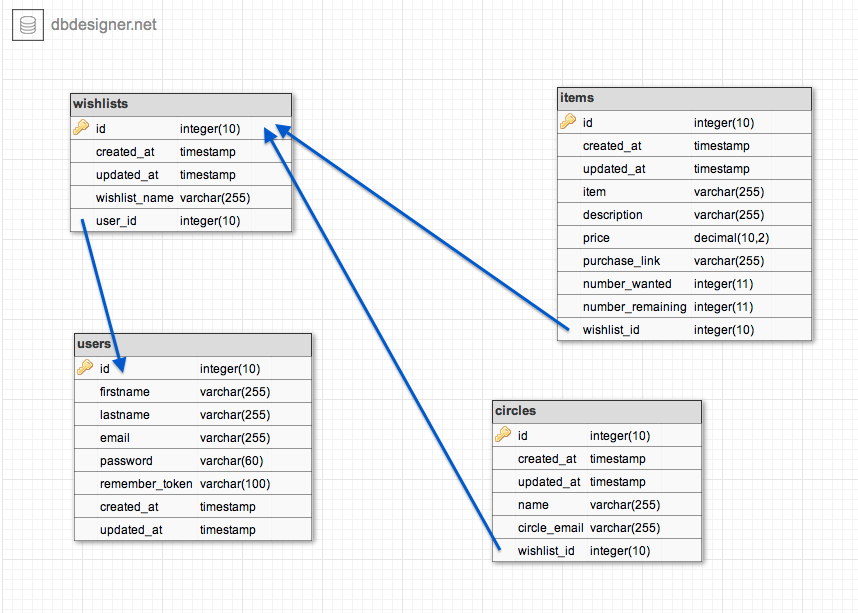

Allyson Bieryla 
================
dwa15 Spring 2016 
---------------
### P4: No Peeking Wishlist                  

#### Project Description

Project 4 is called No Peeking Wishlist. The purpose of this application is a website where you can create
wishlists for yourself and share them with your friends and family (your circle). Users must create a login 
identity to begin. Once logged in a user will be taken to their Home page which will display My Wishlists  
(ones that the user created) and My Circle Wishlists (which is shared with the user by other users). A user is 
able to create wishlists and delete them. Once a wishlist is created a user can add items, and items can be
edited or deleted at any time. Finally, once a user is happy with the wishlist, they are then able to share  
the wishlist with family and friends. A user is only able to view wishlists that are shared with him/her.
The best part is the logged in user never sees an updated version of what has been bought off his/her own
wishlist, but users are able to update their connected Circle wishlists if they buy something off of it.

I've made use of Session flash messages to update users when they add, edit, delete or share certain things. I've 
also error checked inputs and checked to make sure that users don't share the same wishlist with a person more
than once.

My wishlist plan evolved as I began designing my course. While the exact layout is not how I originally planned
in my p4 planning document, the wishlist does all the features that I expected it to. Instead of emailing 
groups passwords, I imagined that it would be easier for all users to just create an account and wishlists would 
be linked automatically behind the scenes. 

References: For the design of this site I used on Bootstrap. I referenced class notes and Foobooks for 
	    coding design. I used dbdesigner.net to create my tables outline.

#### Live URL link

http://p4.abieryla.me

#### Github.com URL

https://github.com/abieryla/p4

#### URL to Demo

#### Table Outline
  
